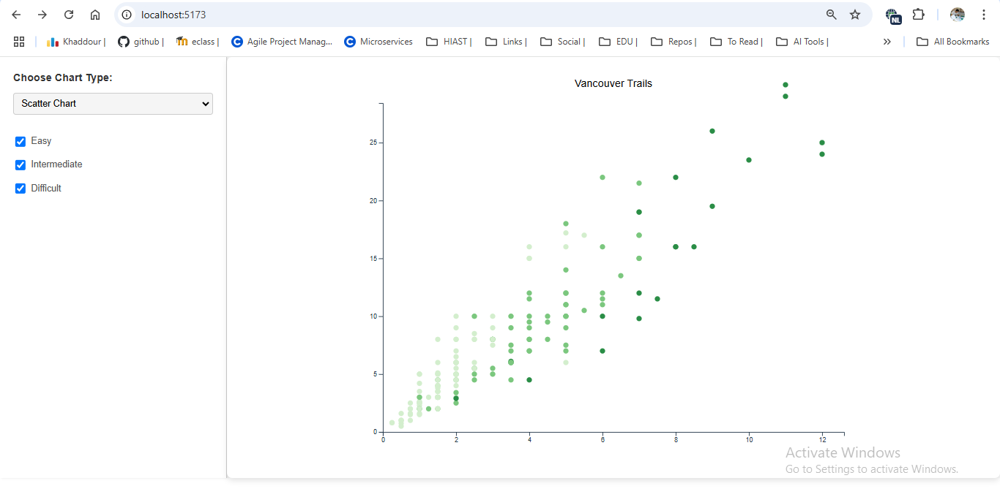

# Lab 4 : Interactive Charts !!

This is a Project For Showing an implementation of basic interavie charts. 

## Features
- **Dynamic Chart Switching**: Choose between scatter and line charts.
- **Data Filters**: Filter data points by difficulty level.
- **Interactive Tooltips**: View data details on hover.

## Technologies Used
- **HTML5, CSS3**
- **TypeScript**
- **D3.js**

## How to Run
1. Clone this repository:
   ```bash
   git clone https://github.com/HasanKhadd0ur/D3Charts.git
   ```
2. Navigate to the project directory:
   ```bash
   cd d3charts
   ```
3. Install dependencies:
   ```bash
   npm install
   ```
4. Start the development server:
   ```bash
   npm run dev
   ```
5. Open your browser and navigate to:
   ```
   http://localhost:5173
   ```

## Usage
1. Use the dropdown to select a chart type.
2. If the scatter chart is selected, toggle the difficulty filters to display specific data points.
3. Hover over data points to view tooltips with additional details.

## File Structure
```
chart/
├── node_modules/
├── public/
├── src/
│   ├── config/                # Configuration files
│   │   ├── chartsConfig.ts
│   │   ├── registrationConfig.ts
│   ├── helpers/               # Helper utilities
│   # Chart-related classes
│   ├── baseChart.ts
│   ├── lineChart.ts
│   ├── scatterChart.ts
│   │
│   ├── main.ts                # Main entry point
├── index.html                 # Main HTML file
├── package.json               # Project dependencies
├── package-lock.json          # Lock file for npm
├── README.md                  # Project documentation
├── tsconfig.json              # TypeScript configuration
├── .gitignore                 # Ignored files for Git
```
### Line Chart ! 

 

### interactive with check boxes 

 

### Tooltip 


### scatter chart 

